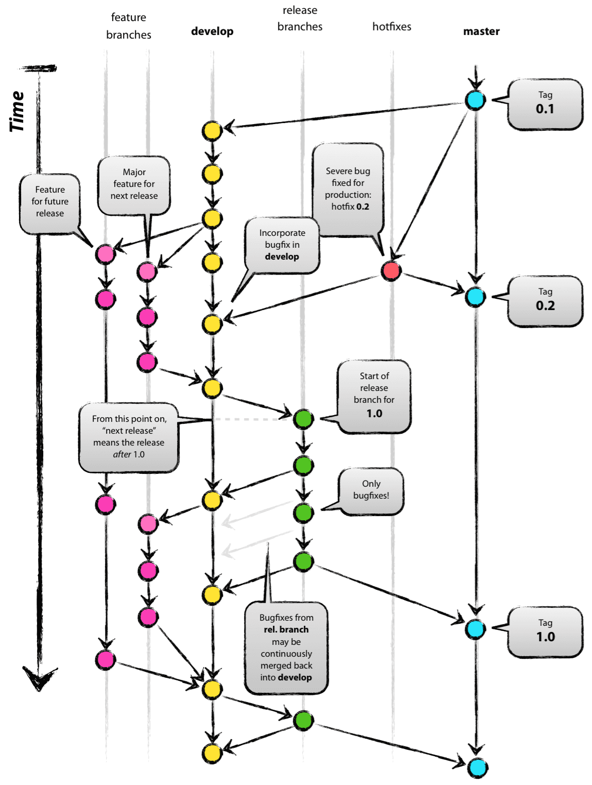

---

<!-- .slide: data-background-video="https://cdn.flixel.com/flixel/v26zyfd6yf0r33s46vpe.tablet.mp4" data-background-video-loop="loop" data-background-video-muted -->
### Version Control with GIT
#### A Short Introduction


---

<!-- .slide: data-background-video="https://cdn.flixel.com/flixel/52vy4yxt8yw76d2u8dsm.tablet.mp4" data-background-video-loop="loop" data-background-video-muted -->
<div class="dark-bg">
  Hello friends! <span class="emoji">👋</span>
  My name is <span class="red"><b>Tauqeer Ahmad</b></span>
</div>
<div class="dark-bg away fragment">
  I am <strong>Assistant Project Manager @ POWERSOFT19 <span class="emoji">🏫</span></strong>,
  <strong>Fullstack Developer <span class="emoji">🥞</span></strong>, and
  <strong>Your trainer for this session <span class="emoji">👌</span>
</div>

---

<!-- .slide: data-background-video="https://cdn.flixel.com/flixel/c8t92d7m4t5w4af4gmnc.hd.mp4" data-background-video-loop="loop" data-background-video-muted -->
<div class="dark-bg">
  <h3 class="away">
    The Three States
  </h3>
</div>

---

<!-- .slide: data-background-video="https://cdn.flixel.com/flixel/c8t92d7m4t5w4af4gmnc.hd.mp4" data-background-video-loop="loop" data-background-video-muted -->
<div class="dark-bg away">
  This is the main thing to remember about Git if you want the rest of your learning process to go smoothly.

  Git has three main states that your files can reside in: <b>committed</b>, <b>modified</b>, and <b>staged</b>
</div>

---

<!-- .slide: data-background-video="https://cdn.flixel.com/flixel/c8t92d7m4t5w4af4gmnc.hd.mp4" data-background-video-loop="loop" data-background-video-muted -->
<div class="dark-bg away">
  
</div>

---

<!-- .slide: data-background-video="https://cdn.flixel.com/flixel/bbqzgcm54sbewywlcl1d.hd.mp4" data-background-video-loop="loop" data-background-video-muted -->
<div class="dark-bg">
  <h3 class="away">
    Local Operations
  </h3>
</div>

---

<!-- .slide: data-background-video="https://cdn.flixel.com/flixel/bbqzgcm54sbewywlcl1d.hd.mp4" data-background-video-loop="loop" data-background-video-muted -->
<div class="dark-bg">
  <br>
  <ol>
    <li>You modify files in your working directory.</li>
    <li>You stage the files, adding snapshots of them to your staging area.</li>
    <li>You do a commit, which takes the files as they are in the staging area and stores that snapshot permanently to your Git directory.</li>
  </ol>
  <br>
  <br>
</div>

---

<!-- .slide: data-background-video="https://cdn.flixel.com/flixel/de6w5hh1ijhzux3c3pah.tablet.mp4" data-background-video-loop="loop" data-background-video-muted -->
<div class="dark-bg">
  <h3 class="away">
    Getting a Git Repository
  </h3>
</div>

---

<!-- .slide: data-background-video="https://cdn.flixel.com/flixel/de6w5hh1ijhzux3c3pah.tablet.mp4" data-background-video-loop="loop" data-background-video-muted -->
<div class="dark-bg fragment">
  <h4>Initialize</h4>

  ``` git init ```
</div>
<div class="dark-bg fragment">
  <h4>Status</h4>

  ``` git status ```
</div>
<div class="dark-bg fragment">
  <h4>Difference</h4>

  ``` git diff ```
</div>

---

<!-- .slide: data-background-video="https://flixels.s3.amazonaws.com/flixel/3uvqg0wiaxbi5blj9qda.webm" data-background-video-loop="loop" data-background-video-muted -->
<div class="dark-bg">
  <h3 class="away">
    GIT Branches
  </h3>
</div>

---

<!-- .slide: data-background-video="https://flixels.s3.amazonaws.com/flixel/3uvqg0wiaxbi5blj9qda.webm" data-background-video-loop="loop" data-background-video-muted -->
<div class="dark-bg fragment">
  <h4>All Branches</h4>

  ``` git branch ```
</div>
<div class="dark-bg fragment">
  <h4>Create Branch</h4>

  ``` git branch [name-of-branch] ```
</div>
<div class="dark-bg fragment">
  <h4>Checkout</h4>

  ``` git checkout [name-of-branch] ```
</div>

---

<!-- .slide: data-background-video="https://flixels.s3.amazonaws.com/flixel/etkm6cv4mvwc18qejgl3.webm" data-background-video-loop="loop" data-background-video-muted -->
<div class="dark-bg">
  <h3 class="away">
    GIT Workflow
  </h3>
</div>

---

<!-- .slide: data-background-video="https://flixels.s3.amazonaws.com/flixel/etkm6cv4mvwc18qejgl3.webm" data-background-video-loop="loop" data-background-video-muted -->
<div class="dark-bg">
  
</div>

---

<!-- .slide: data-background-video="https://flixels.s3.amazonaws.com/flixel/etkm6cv4mvwc18qejgl3.webm" data-background-video-loop="loop" data-background-video-muted -->
<div class="dark-bg">
  
</div>

---

<!-- .slide: data-background-video="https://media.giphy.com/media/3ohs7JG6cq7EWesFcQ/giphy.mp4" data-background-video-loop="loop" data-background-video-muted -->
